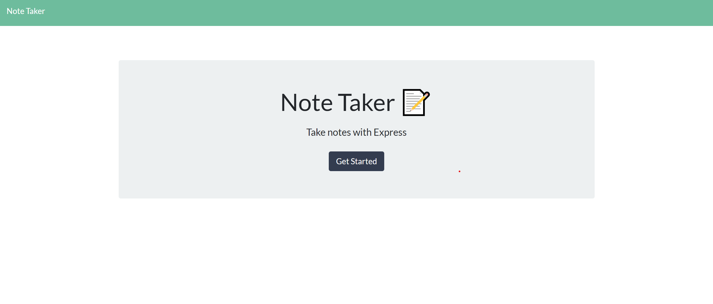
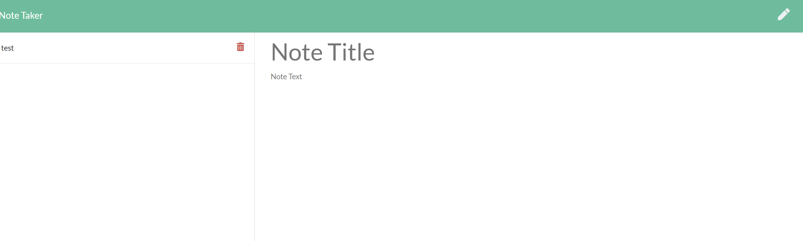
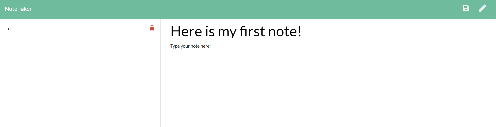
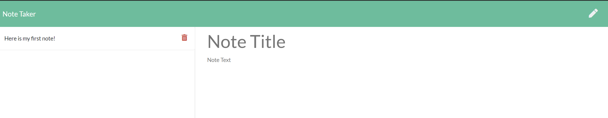
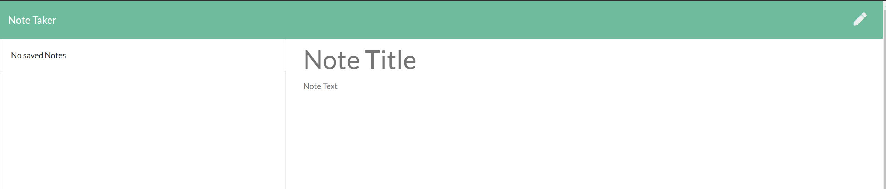

# Notetakerapp

     
 ## Table of Contents 

- [Description](#Description)

- [Installation](##Installation)

- [Contribute](##Contribute)

- [Testing](##Testing)

- [Contribute](##Contribute)

- [Licensing](###Licensing)
         
    
 ## Description: 
 Notetakerapp fills one of the most important gaps for not just a developer, but for anyone who has to write, save, and delete notes as part of their daily routine. Through using `node js`, `JavaScript`, and employing a live server, the user can successfully write, store, and delete their daily notes for a variety of purposes.
    
 ## Installation:      
  Notetakerapp runs on `node js`, and requires `express`. Make sure that these are correctly installed in the terminal by running `npm i`.
 
 ## Email
If you have any questions about Notetakerapp, please feel free to contact me via email:  
 gregjleighton@gmail.com

    
 ## GitHub
    
 Also feel free to checkout the GitHub repo: https://github.com/preussenfahrer/notetakerapp
          
    
 ## Contribute:

Want to contribute to Notetakerapp? Feel free to fork it! After creating your own branch and adding the changes you'd like to see, submit a pull request.   
 
    
   
 ## Testing:
 To checkout the functionality of the application, here is a series of five images that show how one goes to the note pages, makes a note, saves the note, and then deletes said note. You can also see the functionality of this in the demo video.
    
 
 
 
 
 

  Not a fan of looking through the pictures? Check out the video link! https://drive.google.com/file/d/1oCOtYvZiA653tQ28nJqmp-Obo0222_qJ/view  
   
 ## Licensing:
    
 MIT License
    
   
 
  